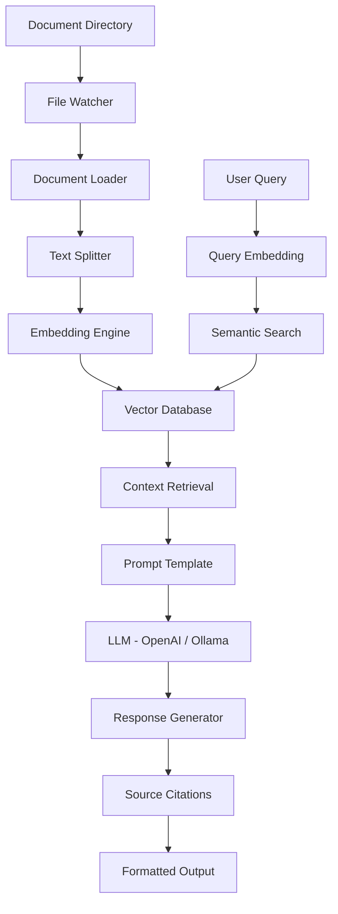

# geekGrep: Intelligent Document Query System

*A production-ready local RAG pipeline for semantic document search and AI-powered question answering*

## 🎯 Executive Summary

geekGrep is a sophisticated document intelligence platform that transforms how technical professionals interact with their knowledge bases. By leveraging advanced Retrieval-Augmented Generation (RAG) architecture, the system enables natural language queries across PDF, Markdown, and text documents with precise, traceable answers sourced from the user's own document corpus.

## 🚀 Vision & Objectives

Build an enterprise-grade CLI and web interface that allows users to drop directories of technical documentation and query them using Large Language Models. The system performs intelligent semantic search to retrieve relevant context before generating accurate, citable responses — powered by OpenAI for speed and quality, with optional local inference via Ollama for fully offline use.

### Key Differentiators
- **Swappable LLM Backend**: OpenAI API for speed and quality, Ollama for fully local/offline use
- **Production Architecture**: Asynchronous processing, proper error handling, and scalable design
- **Enterprise Features**: Metadata filtering, traceability, and dockerized deployment
- **Developer Experience**: Clean APIs, comprehensive logging, and extensible architecture

## 📋 Core Functional Requirements

### 🔄 Document Ingestion Pipeline
- **Smart File Watching**: Real-time monitoring for `.pdf`, `.md`, and `.txt` files
- **Format Agnostic**: Unified processing for multiple document types
- **Incremental Updates**: Efficient re-processing of modified documents only

### 🧠 Intelligent Chunking Strategy
- **Semantic-Aware Splitting**: Recursive character splitting that preserves document structure
- **Context Preservation**: Maintains header hierarchy and section relationships
- **Optimized Overlap**: Configurable chunk overlap to prevent context loss at boundaries

### 🗄️ Vector Storage & Retrieval
- **Flexible Backend**: Support for both ChromaDB (persistent) and FAISS (ephemeral)
- **High-Performance Search**: Cosine similarity optimization for sub-second retrieval
- **Scalable Architecture**: Handles document collections from hundreds to thousands of files

### 🤖 Flexible AI Inference
- **OpenAI Integration**: GPT-4o-mini (default) for fast, high-quality responses
- **Local Fallback**: Ollama support for offline/privacy-sensitive use cases
- **Backend Agnostic**: LangChain abstraction allows swapping models with a single config change

### 📊 Response Traceability
- **Source Citation**: Every answer includes exact filename, page number, and line references
- **Confidence Scoring**: Quantitative measures of answer reliability
- **Context Preview**: Display of relevant source snippets alongside answers

## 🛠️ Technical Architecture

### Core Technology Stack

| Layer | Technology | Rationale |
|-------|------------|-----------|
| **Orchestration** | LangChain | Production-ready RAG framework with extensive integrations |
| **Embeddings** | HuggingFace all-MiniLM-L6-v2 | Optimal balance of performance and resource efficiency |
| **Vector Database** | ChromaDB | Persistent storage with advanced filtering capabilities |
| **LLM Backend** | OpenAI API (primary) / Ollama (fallback) | Fast cloud inference with optional local offline mode |
| **Web Interface** | Streamlit | Rapid prototyping with production-ready components |
| **CLI Interface** | Typer | Type-safe CLI framework with auto-completion |

### System Architecture Flow



### Advanced Prompt Engineering

```
You are an expert technical assistant specializing in document analysis.
Using the provided context, answer the user's question accurately and concisely.

Requirements:
- Answer only if information is present in the context
- Include specific source citations (filename, page, line)
- Indicate confidence level in your response
- Suggest follow-up questions when appropriate

Context: {context}
Question: {question}
```

## 💼 Professional Features & Implementation

### 🔍 Advanced Metadata Filtering
- **Temporal Filtering**: Query documents modified within custom time ranges
- **File Type Segmentation**: Target specific document formats or sources
- **Content-Based Tags**: Automatic categorization and filtering

### ⚡ Asynchronous Processing Pipeline
- **Non-Blocking Ingestion**: Background document processing using asyncio
- **Progress Tracking**: Real-time status updates for large document sets
- **Error Recovery**: Robust handling of corrupted or inaccessible files

### 🐳 Production Deployment
- **Docker Compose**: One-command deployment with all dependencies
- **Environment Configuration**: Flexible settings for different deployment scenarios
- **Health Monitoring**: Built-in metrics and status endpoints

### 📈 Performance Optimizations
- **Batch Processing**: Efficient embedding generation for document batches
- **Caching Strategy**: Intelligent caching of embeddings and search results
- **Resource Management**: Memory-efficient processing for large document sets

## 🎯 Implementation Roadmap

### Phase 1: Core MVP
- Basic document ingestion and chunking
- Simple vector storage and retrieval
- CLI interface with local LLM integration

### Phase 2: Production Features
- Web interface with Streamlit
- Asynchronous processing pipeline
- Advanced filtering and search capabilities

### Phase 3: Enterprise Enhancements
- Docker deployment automation
- Performance monitoring and metrics
- Advanced prompt engineering and response formatting

## 🏆 Competitive Advantages

1. **Flexible Deployment**: Cloud API for speed or local inference for privacy — user's choice
2. **Cost Efficiency**: GPT-4o-mini keeps per-query costs under $0.01; Ollama option is free
3. **Customization**: Extensible architecture for domain-specific adaptations
4. **Performance**: Sub-second retrieval with fast LLM inference
5. **Traceability**: Enterprise-grade source citation and audit capabilities

---

*This architecture demonstrates expertise in modern AI systems, production engineering, and pragmatic backend design — supporting both cloud and local inference to balance speed, cost, and privacy.*